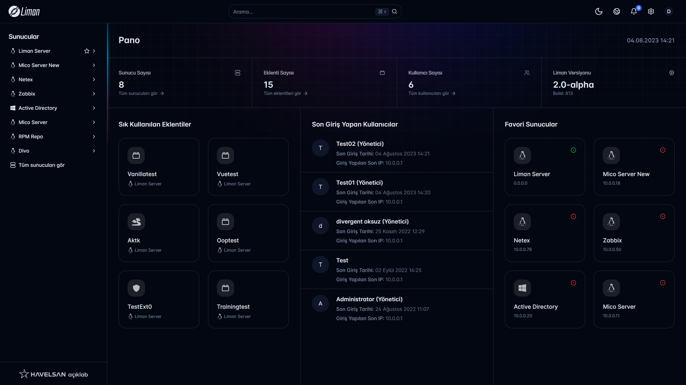
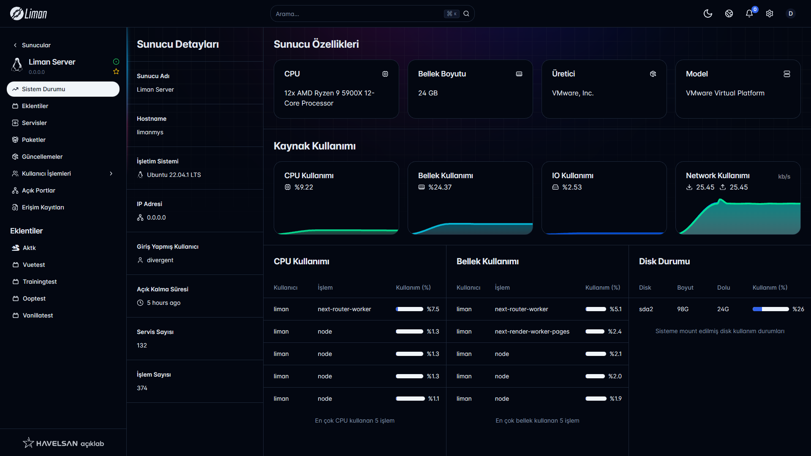
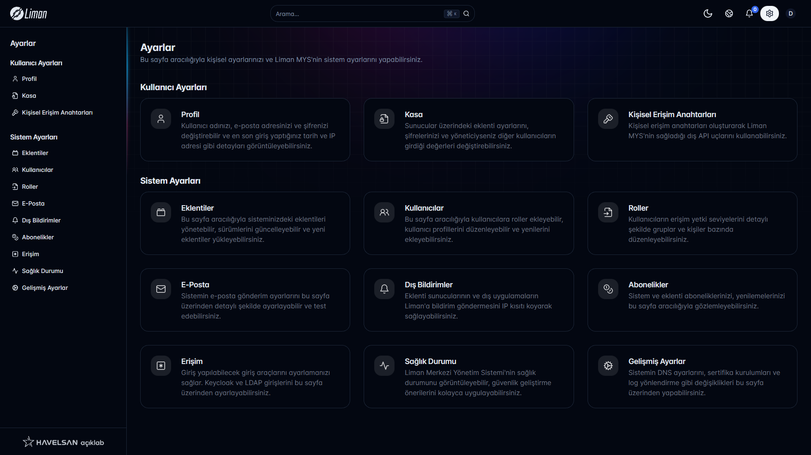

# Liman Next Gen UI

Liman allows you to centrally manage all servers in your IT processes remotely, with stable and secure way. You can improve the features with expandable extensions.

## Preview

#### Dashboard



#### Server Management



#### Settings



## Development

```
pnpm i
pnpm dev
```
